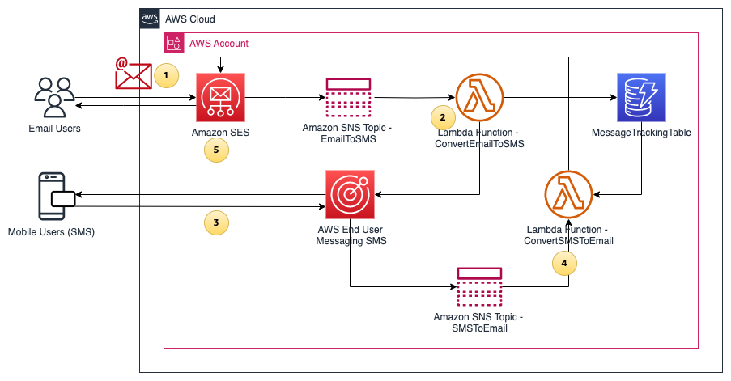
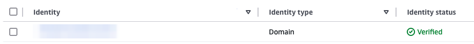

# Two-way Email to SMS Solution

## Overview
This repository contains AWS CloudFormation templates for setting up a two-way Email to SMS solution using various AWS services. The solution allows for seamless communication between email and SMS platforms, enabling users to send and receive messages across these channels.

## Architecture
The following figure shows the high level architecture for this solution



1.	Email Users send an email to the email address formatted as “mobile-number@verified-domain”. Amazon SES email receiving receives the email and triggers a receipt rule.
2.	The email is published to Amazon Simple Notification Service (SNS) topic (EmailToSMS) based on the receipt rule action, which triggers an AWS Lambda function (ConvertEmailToSMS). The ConvertEmailToSMS Lambda function performs the following actions: 
    a.	Receives the event from SNS and constructs a text message using the email body content. 
    b.	The constructed message is then sent to the “mobile-number” in the destination email address using the “SendTextMessage” API from AWS End User Messaging SMS. This is achieved by using a phone number in AWS End User Messaging SMS as the origination identity.
    c.	The SMS message ID and source email address are stored as items in the Amazon DynamoDB table (MessageTrackingTable). This is done to track email addresses for replies from SMS users.
3.	Mobile Users receives the SMS, and they have the option to reply to the phone number with two-way SMS messaging enabled. 
4.	The incoming SMS message from the Mobile Users is received by End User Messaging SMS and published to a SNS topic (SMSToEmail) for two-way SMS integration, which triggers a Lambda function (ConvertSMSToEmail). The ConvertSMSToEmail Lambda function performs the following actions:
    a.	Retrieve the item from “MessageTrackingTable” using “previousPublishedMessageId” (SMS message ID) from the SNS event, and locate the corresponding email address.
    b.	Send the SMS message body to the Email Users using SES. This step uses “mobile-number@verified-domain” as the source email address, and the email address retrieved from the previous step as the destination.
5.	Email Users receive the email, and they have the option to reply to the email to continue the conversation. Only the latest reply will be sent to the Mobile Users.


## Components
1. Email to SMS (email-to-sms.yaml): Converts incoming emails to SMS messages.
2. SMS to Email (sms-to-email.yaml): Converts incoming SMS messages to emails.

## Walkthrough 

There are 4 steps to deploy this solution:

1.	Configure [SES verified identity](https://docs.aws.amazon.com/ses/latest/dg/creating-identities.html) for email receiving and sending
2.	Deploy the CloudFormation stack for the Email to SMS functionality.
3.	Deploy the CloudFormation stack for the SMS to Email functionality
4.	Set up [two-way SMS messaging](https://docs.aws.amazon.com/sms-voice/latest/userguide/two-way-sms.html) in AWS End User Messaging SMS

Note: the code for this solution is developed based on phone numbers and [long code](https://docs.aws.amazon.com/sms-voice/latest/userguide/phone-numbers-request-long-code.html) as the supported origination identity in Australia. You need to adjust the Lambda code accordingly for this to work in your country.

### Prerequisites

1.	Administrator-level access to an AWS account
2.	A domain or subdomain that you own to create [SES verified identity](https://docs.aws.amazon.com/ses/latest/dg/creating-identities.html)
3.	An origination identity that supports two-way messaging, following [Choosing an origination identity for two-way messaging use cases](https://docs.aws.amazon.com/sms-voice/latest/userguide/phone-number-types.html#phone-number-types-choosing-twoway). [Simulator phone numbers](https://docs.aws.amazon.com/sms-voice/latest/userguide/test-phone-numbers.html#test-phone-numbers-origination) are available if you are in the US.
4.	A mobile phone to send and receive SMS
5.	An email address to send and receive emails

### Step 1: Configure SES Verified Identity
 
Follow the steps outlined in Creating a domain identity to create a verified identity for your domain in your AWS account. Confirm your domain identity is in the “Verified” status before proceeding to the next step:



### Step 2: Deploy Email to SMS functionality

The following steps create a CloudFormation stack to deploy the required components for Email to SMS functionality:

1.	Sign in to your AWS account
2.	Download the [email-to-sms.yaml](https://github.com/aws-samples/two-way-email-to-sms-with-ses/blob/main/email-to-sms.yaml) for creating the stack
3.	Navigate to the AWS CloudFormation page
4.	Choose Create stack, and then choose **With new resources (standard)**.
5.	Choose **Upload a template file** and upload the CloudFormation template that you downloaded earlier: email-to-sms.yaml. Then choose Next.
6.	Enter the stack name **Email-To-SMS**.
7.	Enter the following values for the parameters:
  a.	**RuleName**: The name of your SES Rule Set and receipt rule.
  b.	**Recipient1**: Domain name used for recipient condition in the SES Rule Set.
  c.	**Recipient2**: Domain name used for recipient condition in the SES Rule Set if you need additional recipients.
  d.	**PhoneNumberId**: Phone number ID of the phone number to send SMS messages.
8.	Choose **Next**, and then optionally enter tags and choose Submit. Wait for the stack creation to finish.
Now you have the required components to convert email to text, and sending it as SMS to a phone number using SNS. However, by default, SNS does not have the required permission to use Phone numbers in AWS End User Messaging SMS. 

Note: if required, modify the following code in email-to-sms.yaml to format your phone numbers accordingly:

```python
def format_phone_number(email_address):
    # Extract the local part of the email address (before @)
    local_part = email_address.split('@')[0]
    
    # Remove the leading '0' and add '+61' for phone number (Australia)
    if local_part.startswith('0'):
        formatted_number = '+61' + local_part[1:]
    
    return formatted_number

### Step 3: Deploy SMS to Email functionality
```

The following steps create a CloudFormation stack to deploy the required components for SMS to Email functionality:

1.	Sign in to your AWS account
2.	Download the [sms-to-email.yaml](https://github.com/aws-samples/two-way-email-to-sms-with-ses/blob/main/sms-to-email.yaml) for creating the stack
3.	Navigate to the AWS CloudFormation page
4.	Choose Create stack, and then choose**With new resources (standard)**.
5.	Choose **Upload a template file** and upload the CloudFormation template that you downloaded earlier: sms-to-email.yaml. Then choose Next.
6.	Enter the stack name **SMS-To-Email**.
7.	Enter the following values for the parameters:
  a.	**EmailDomain**: The email domain to use for the SMS-to-Email function
8.	Choose **Next**, and then optionally enter tags and choose Submit. Wait for the stack creation to finish.

### Step 4: Set up Two-Way Messaging in AWS End User Messaging SMS

Follow the below step 1 – 5 outlined in [Set up two-way SMS messaging for a phone number in AWS End User Messaging SMS](https://docs.aws.amazon.com/sms-voice/latest/userguide/two-way-sms-phone-number.html), for step 6:
-	For **Destination type**, choose either Amazon SNS.
-	Choose **Existing SNS standard topic**.
-	For **Incoming messages destination**, choose the SNS topic created from Step 3 (default topic name is SMSToEmailTopic).
-	For **Two-way channel role**, choose Use SNS topic policies.
-	Choose **Save changes**.

This allows your origination identity (phone number) to receive incoming messages, which is then published to an SNS topic and converted into emails.

Note: if required, modify the following code in sms-to-email.yaml to format your phone numbers accordingly:

```python
def format_phone_number(phone_number):

    # Replace the '+61' with '0' from the phone number (Australia)
    formatted_number = f"0{mobile_number[3:]}"

    return formatted_number

### Testing
```

To test the solution, send an email with the destination address of “mobile-number@verified-domain”. You should receive a SMS on your mobile with the following information:
-	Source number: AWS End User Messaging phone number
-	Message: Email body content

Note: AWS End User Messaging SMS has [character limit](https://docs.aws.amazon.com/sms-voice/latest/userguide/sms-limitations-character.html) for SMS messages depending on the type of characters the message contains. This solution only takes the first 160 characters of the email body by default, you can adjust the EmailToSMS Lambda function as required. 

Reply directly to the SMS, you should receive an email at the same email address that sent the original email, with the following information:
-	Subject: Re:mobile-number
-	Body: SMS message content
-	Source email address: mobile-number@verified-domain

If you are not receiving the email or SMS, check the Lambda CloudWatch logs for troubleshoowing.

## Cleaning up

To remove unneeded resources after testing the solution, follow these steps:

1.	In the CloudFormation console, delete the Email-To-SMS stack. 
2.	In the CloudFormation console, delete the SMS-To-Email stack. 
3.	If applicable, in Amazon SES, delete the verified identities
4.	If applicable, in AWS End User Messaging, release the unused phone numbers

## License
This project is licensed under the MIT License - see the [LICENSE](LICENSE) file for details.

## Support
For any questions or issues, please open an issue in the GitHub repository.